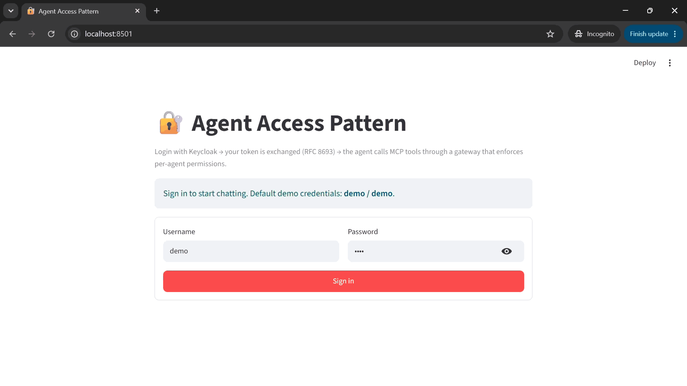
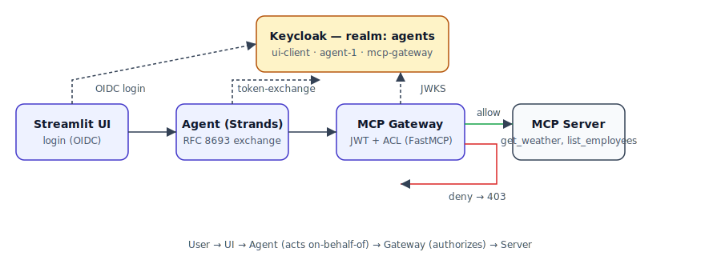

# 🔐 Agent Access Pattern

> **Real OAuth2 for AI agents.** A drop-in reference implementation of the emerging *Agent Access Pattern* — user → agent → MCP gateway → MCP server — with Keycloak enforcing **RFC 8693 token exchange** and per-agent, per-tool authorization. One `docker compose up`, one `curl`, and you have a working pattern you can extend to production.

<p align="center">
  
</p>

<p align="center">
  
</p>

## Why this repo

Everyone is building agents. Almost nobody wires them into their existing IAM. This repo shows, end-to-end and in code, how to :

- Log a human into an agent UI with a **real identity provider** (Keycloak).
- Have the agent act **on behalf of** that user via a proper **RFC 8693 token exchange** — the agent appears in the `act` / `azp` claims so audit trails stay honest.
- Enforce **fine-grained, per-tool authorization** at an **MCP Gateway** (FastAPI proxy) — tool servers stay dumb, policy stays at the edge.
- Prove it works with two tools : `get_weather` (allowed for `agent-1`) and `list_employees` (denied).

Batteries included : Streamlit UI, Strands agent, FastAPI + FastMCP gateway + server, and Keycloak with a **pre-provisioned realm** — no clicking through admin consoles.

## 🚀 Quickstart (30 seconds, no clone)

Pulls prebuilt images from GHCR, no build step required.

### 1. Log in to AWS first (only if you use Bedrock)

If you plan to use the default Bedrock provider, log in with your SSO profile **before** running the installer so the script can pick up your credentials :

```bash
aws sso login --profile <your-profile>
aws configure export-credentials --profile <your-profile> --format env-no-export
```

> Skip this step if you'll use the `mock` provider (no LLM needed).

### 2. Run the installer

```bash
curl -fsSL https://raw.githubusercontent.com/victortaki/agent-access-pattern/main/install.sh | sh
```

Then open **http://localhost:8501** and sign in with `demo / demo`.

Ask :
- *"what is the weather in Paris?"* → **`The weather in Paris is sunny.`**
- *"list the employees of the company"* → **`Agent 'agent-1' does not have permission to call tool 'list_employees'.`**

That's the pattern. In production, swap the tools, the LLM, and the permission map — the flow stays identical.

### 3. Update configuration

If you edit any configuration and need to reload the stack :

```bash
docker compose down
docker compose up -d
```

### 4. Clean up

Stop the stack, remove volumes, and delete pulled images :

```bash
docker compose down -v
docker images | grep "agent-access-pattern" | awk '{print $3}' | xargs docker rmi -f
```

---

## 🧑‍💻 Full local setup

### Prerequisites

- Docker + Docker Compose (Docker Desktop on Windows/Mac, or native on Linux).
- On Windows : use **WSL2 Ubuntu** as your shell for all commands below.
- Optional : **Miniconda / Anaconda** if you want a Python env for hacking on the code outside containers.
- Optional : an **AWS account with Bedrock access** if you want a real LLM instead of the built-in mock router.

### 1. Get the code

```bash
git clone https://github.com/victortaki/agent-access-pattern.git
cd agent-access-pattern
```

### 2. Create the conda env

```bash
conda env create -f environment.yml
conda activate agent-access-pattern
```

### 3. Configure `.env`

```bash
cp .env.example .env
```

`docker compose` automatically reads any file named `.env` in the current directory and substitutes `${VAR}` references in `docker-compose.yml`.

Open `.env` and adjust the following if needed :

| Variable | Default | Purpose |
|---|---|---|
| `IMAGE_REGISTRY` | `ghcr.io/victortaki/agent-access-pattern` | Where prebuilt images are pulled from. |
| `IMAGE_TAG` | `latest` | Image tag. |
| `STRANDS_MODEL_PROVIDER` | `bedrock` | `mock` / `bedrock` / `openai`. |
| `AWS_REGION` | `eu-west-1` | Bedrock region — must match where the model is enabled. |
| `BEDROCK_MODEL_ID` | `eu.anthropic.claude-sonnet-4-5-20250929-v1:0` | Must be prefixed (`us.` / `eu.` / `apac.`) for newer models. |
| `OPENAI_API_KEY` / `OPENAI_BASE_URL` / `OPENAI_MODEL` | — | For `openai` provider. |

### 4. Pick an LLM provider

**Option A — `mock` (zero setup, keyword router).** Perfect for showcasing the auth pattern without needing any API key. Recommended first run.

```
STRANDS_MODEL_PROVIDER=mock
```

**Option B — AWS Bedrock (what this repo was tested against).**

```
STRANDS_MODEL_PROVIDER=bedrock
AWS_REGION=eu-west-3
BEDROCK_MODEL_ID=eu.anthropic.claude-sonnet-4-5-20250929-v1:0
```

Then inject your AWS credentials into `.env` (SSO example) :

```bash
aws sso login --profile <your-profile>
aws configure export-credentials --profile <your-profile> --format env-no-export >> .env
```

That appends `AWS_ACCESS_KEY_ID`, `AWS_SECRET_ACCESS_KEY`, `AWS_SESSION_TOKEN` to `.env`. Docker Compose passes them to the agent container.

> SSO tokens expire (typically 8-12 h). When you see *"Unable to locate credentials"* or *"ExpiredToken"* later, refresh with the same two commands.

**Option C — OpenAI (or any OpenAI-compatible endpoint).**

```
STRANDS_MODEL_PROVIDER=openai
OPENAI_API_KEY=sk-...
OPENAI_MODEL=gpt-4o-mini
# OPENAI_BASE_URL=https://... # optional for Groq, Together, Ollama, etc.
```

### 5. Start the stack

```bash
docker compose up -d
```

First build takes 5-10 min (Keycloak image is ~700 MB). Subsequent runs are near-instant thanks to Docker layer caching.

Verify :

```bash
docker compose ps
```

You should see 5 services running : `keycloak`, `mcp-server`, `mcp-gateway`, `agent`, `ui`.

### 6. Test

Open **http://localhost:8501** in your browser and log in with **`demo / demo`**.

> **Tip :** Use an **incognito / private browser window** for every test during development to prevent interference from stale Keycloak cookies.

Ask :
- *"what is the weather in Paris?"* → allowed → answer with "sunny"
- *"list the employees of the company"* → denied → the LLM tells you it has no permission

You can also run the curl-based end-to-end test :

```bash
bash scripts/smoke.sh
```

---

## 🔁 Common operations

```bash
# Iterate on the UI code (rebuild + restart just that service)
docker compose up -d --build ui

# Force fresh start of one service (drops cached state)
docker compose down ui && docker compose up -d --build ui

# Follow logs (all or one service)
docker compose logs -f
docker compose logs -f agent

# Check service state
docker compose ps
# or if you have make installed
make ps

# Pause the stack overnight (keeps everything, resumes instantly)
docker compose stop

# Come back the next day
docker compose start

# Full reset (also wipes Keycloak users you may have created — the demo one is re-imported)
docker compose down -v
```

---

## 🧩 Extend it

**Add a new tool** → edit `mcp-server/server.py`. Grant it in `mcp-gateway/permissions.yaml`.

**Add a new agent** → new confidential client in `keycloak/realm-agents.json` with `"standard.token.exchange.enabled": "true"`, new entry in `permissions.yaml`, new service in `docker-compose.yml`.

**Add a new MCP server** → run another FastMCP container, point another gateway (or a routing gateway) at it.

**Swap the gateway for FastMCP-native** → the current `gateway.py` is FastAPI-based for pedagogy (JWT + ACL in ~150 explicit lines). An equivalent using `FastMCP.as_proxy()` + `BearerAuthProvider` + `Middleware.on_call_tool` would be ~40 lines and MCP-conformant to the letter. See `docs/architecture.md`.

---

## 🏗️ CI / images

`.github/workflows/build-and-push.yml` builds and pushes four multi-arch images to GHCR on every push to `main` and every `v*` tag :

- `ghcr.io/victortaki/agent-access-pattern/ui`
- `ghcr.io/victortaki/agent-access-pattern/agent`
- `ghcr.io/victortaki/agent-access-pattern/mcp-gateway`
- `ghcr.io/victortaki/agent-access-pattern/mcp-server`

Images are public — no login needed for `docker pull`.

---

## 🗺️ Roadmap

- [ ] OPA / Cedar policy engine adapter for the gateway.
- [ ] Second agent + second MCP server showing least-privilege delegation.
- [ ] Redis-backed rate limiting per (agent, tool).
- [ ] Observability : OpenTelemetry traces spanning UI → agent → gateway → server.
- [ ] Helm chart + Kind quickstart.
- [ ] Auth-code + PKCE flow instead of password grant in the UI (prod-grade).

---

## 📝 License

MIT — see [`LICENSE`](LICENSE).

## 🙋 Contributing

Issues and PRs welcome. If this pattern helps you ship, please ⭐ the repo — it's the cheapest way to help others discover it.
